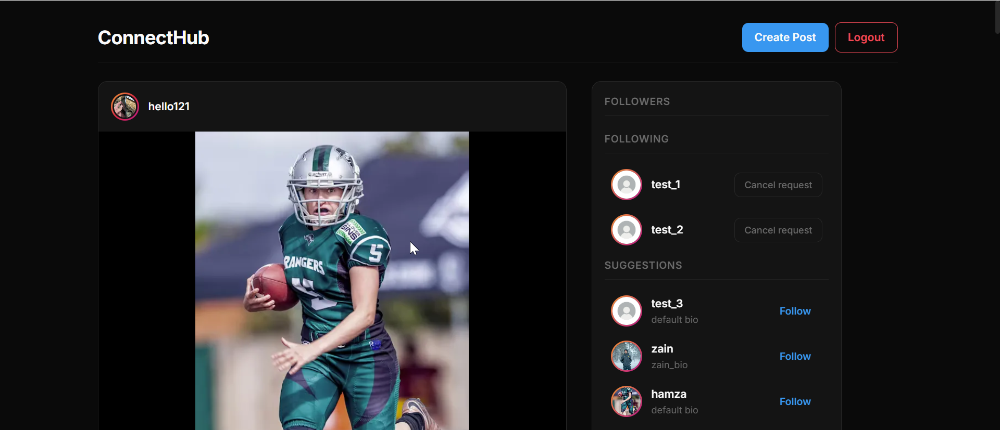

# ConnectHub

A full-stack social networking app with authentication, posts, likes, and follow system.

## Features

- User authentication (JWT + HTTP-only cookies)
- Create posts with image and caption
- Like and unlike posts
- Follow system (request, accept/reject)
- Personalized feed
- Suggested users

## Tech Stack

**Frontend:**
- React, Context API, Axios, SCSS

**Backend:**
- Node.js, Express.js, MongoDB (Mongoose)

**Other:**
- ImageKit (image uploads)
- JWT (authentication)

## Screenshots

## Setup

1. Clone the repo
2. Install dependencies

Backend:
cd Backend
npm install

Frontend:
cd Frontend
npm install

3. Add .env file

4. Run project

Backend:
npm run dev

Frontend:
npm run dev

## Future Improvements

- Improve feed scalability
- Add real-time notifications
- Implement refresh token flow